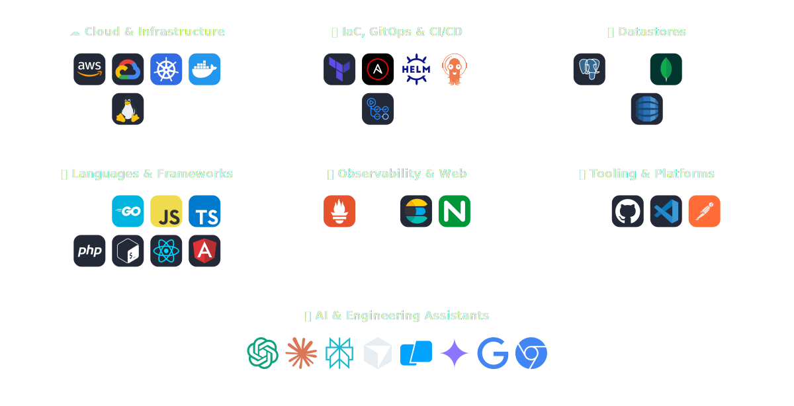

 

  
  
  
  

## About Me

- About **25 years** in high-tech across **South Africa, Spain, and Israel** - hands-on software
  engineering, technical leadership, **DevOps**, and **cloud architecture**
- Focus: **automation-first** delivery, **operational reliability**, **security-by-design**,
  **performance tuning**, and **cost optimization**
- Building and operating **cloud-native** platforms, **Kubernetes**, **IaC**, and **CI/CD**; exploring
  **AI** in DevOps for smarter, faster workflows
- Open to **DevOps**, **Platform Engineer**, or **Solution Architect** roles; **global relocation**
- Languages: **English** and **Hebrew** (fluent), **Spanish** (working proficiency)
- Ask me about **AWS, Kubernetes, Terraform, Docker, GitOps, and platform design**

## Tech Stack

<!--START_SECTION:skills_icons-->

  

<!--END_SECTION:skills_icons-->

## GitHub Stats

<!--START_SECTION:github_stats-->

<em>Live metrics below are refreshed by GitHub Actions (followers, public repos, total stars on
owned repos, member since).</em>

  
  
  
  

<!--END_SECTION:github_stats-->

## GitHub Activity Graph

## GitHub Trophies

## Featured Projects

> Hands-on DevOps and Cloud infrastructure projects

| Project | Description | Stack |
| --- | --- | --- |
| [docker-compose-ai-gateway](https://github.com/talorlik/docker-compose-ai-gateway) | AI microservice mesh deployed via Docker Compose | Python, Docker |
| [ldap-2fa-on-k8s](https://github.com/talorlik/ldap-2fa-on-k8s) | LDAP authentication with 2FA deployed on K8S | Shell, Helm |
| [wikijs-on-k8s](https://github.com/talorlik/wikijs-on-k8s) | WikiJS on AWS EKS Auto Mode with Terraform & ArgoCD | HCL, GitOps |
| [eks-deployment](https://github.com/talorlik/eks-deployment) | AWS EKS deployment with Autoscaler & HPA | HCL, Kubernetes |
| [talo-devops-deployment](https://github.com/talorlik/talo-devops-deployment) | Full AWS + Kubernetes Infra + Application deployment | HCL, K8S |
| [docker-compose-and-jenkins-casc](https://github.com/talorlik/docker-compose-and-jenkins-casc) | Jenkins server with JCasC via Docker Compose | Python, Docker |

## Recent Activity

<!--START_SECTION:activity-->

- 🚀 **Pushed** 1 commit(s) to [`talorlik/dockerized-java-app-on-ec2`](https://github.com/talorlik/dockerized-java-app-on-ec2) (main) - 2026-05-05 22:50 UTC
- 🚀 **Pushed** 1 commit(s) to [`talorlik/dockerized-java-app-on-ec2`](https://github.com/talorlik/dockerized-java-app-on-ec2) (main) - 2026-05-05 20:46 UTC
- 🚀 **Pushed** 1 commit(s) to [`talorlik/dockerized-java-app-on-ec2`](https://github.com/talorlik/dockerized-java-app-on-ec2) (main) - 2026-05-05 20:32 UTC
- 🚀 **Pushed** 1 commit(s) to [`talorlik/dockerized-java-app-on-ec2`](https://github.com/talorlik/dockerized-java-app-on-ec2) (main) - 2026-05-05 17:05 UTC
- 🚀 **Pushed** 1 commit(s) to [`talorlik/dockerized-java-app-on-ec2`](https://github.com/talorlik/dockerized-java-app-on-ec2) (main) - 2026-05-05 16:50 UTC
- 🚀 **Pushed** 1 commit(s) to [`talorlik/dockerized-java-app-on-ec2`](https://github.com/talorlik/dockerized-java-app-on-ec2) (main) - 2026-05-05 16:45 UTC
- ✨ **Created** branch in [`talorlik/dockerized-java-app-on-ec2`](https://github.com/talorlik/dockerized-java-app-on-ec2) - 2026-05-04 13:59 UTC
- 🚀 **Pushed** 1 commit(s) to [`talorlik/observability-kit`](https://github.com/talorlik/observability-kit) (main) - 2026-04-26 19:13 UTC
- 🚀 **Pushed** 1 commit(s) to [`talorlik/observability-kit`](https://github.com/talorlik/observability-kit) (main) - 2026-04-26 18:29 UTC
- 🚀 **Pushed** 1 commit(s) to [`talorlik/observability-kit`](https://github.com/talorlik/observability-kit) (main) - 2026-04-26 18:11 UTC
- 🚀 **Pushed** 1 commit(s) to [`talorlik/observability-kit`](https://github.com/talorlik/observability-kit) (main) - 2026-04-26 15:19 UTC
- 🚀 **Pushed** 1 commit(s) to [`talorlik/talorlik`](https://github.com/talorlik/talorlik) (main) - 2026-04-20 12:21 UTC
- 🚀 **Pushed** 1 commit(s) to [`talorlik/talorlik`](https://github.com/talorlik/talorlik) (main) - 2026-04-20 12:15 UTC
- 🚀 **Pushed** 1 commit(s) to [`talorlik/talorlik`](https://github.com/talorlik/talorlik) (main) - 2026-04-20 10:53 UTC
- 🚀 **Pushed** 1 commit(s) to [`talorlik/talorlik`](https://github.com/talorlik/talorlik) (main) - 2026-04-20 10:41 UTC
- 🚀 **Pushed** 1 commit(s) to [`talorlik/talorlik`](https://github.com/talorlik/talorlik) (main) - 2026-04-16 20:26 UTC
- 🚀 **Pushed** 1 commit(s) to [`talorlik/talorlik`](https://github.com/talorlik/talorlik) (main) - 2026-04-16 20:23 UTC
- 📌 **ForkEvent** in [`nirgeier/AnsibleLabs`](https://github.com/nirgeier/AnsibleLabs) - 2026-04-15 15:09 UTC
- 🚀 **Pushed** 1 commit(s) to [`talorlik/observability-kit`](https://github.com/talorlik/observability-kit) (main) - 2026-04-08 14:48 UTC
- 🚀 **Pushed** 1 commit(s) to [`talorlik/observability-kit`](https://github.com/talorlik/observability-kit) (main) - 2026-04-07 15:29 UTC

<!--END_SECTION:activity-->
